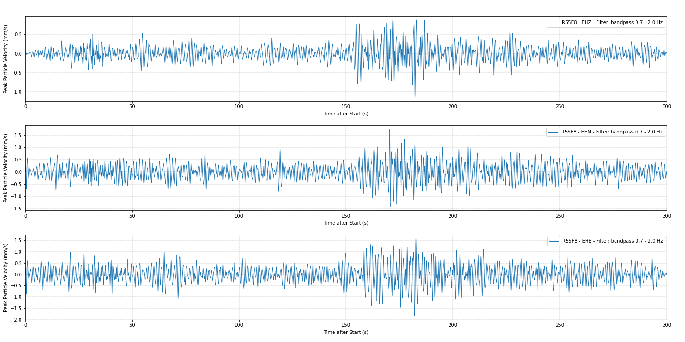

# peak-particle-velocity
Raspberry Shake Peak Particle Velocity (PPV) calculation script

This script will read data from a 3D unit on the Raspberry Shake AM network and convert the output displacement (in mm) into Ground Vibration measurement (PPV). 

The source for the conversion formula is [here](https://www.castlegroup.co.uk/guidance/ground-vibration/ground-vibration/).



Required software and packages:
- Python 3
- Jupyter
- Obspy
- Matplotlib
- Numpy

Installation via Anaconda:
```bash
# install the environment with the correct software:
conda create -n ppvmotion python=3 jupyter matplotlib obspy numpy
# activate the environment
conda activate ppvmotion
# start Jupyter Notebook
jupyter-notebook
```

Once this is done, it is possible to open the `.ipynb` file in the repository: - [PPVmotion.ipynb](PPVmotion.ipynb)

The file is commented throughout the various steps, however, this is a brief guide to use it: 

1. Insert a valid Raspberry Shake 3D (RS3D) unit code
2. Insert a valid start and end time references for the script to work. The format is "YYYY-MM-DDThh:mm:ss.ddd"
3. If needed, modify the values for the filtering process (the default is a bandpass filter between 0.7 Hz and 2.0 Hz).
4. The filter can also be removed by commenting out (with ```#```) line 48 of the script ```st.filter("bandpass", freqmin=f1, freqmax=f2, corners=cor)```

Done! By executing the script a plot will be created which shows the Peak Particle Velocity (in mm/s) for each channel of the RS3D unit.
