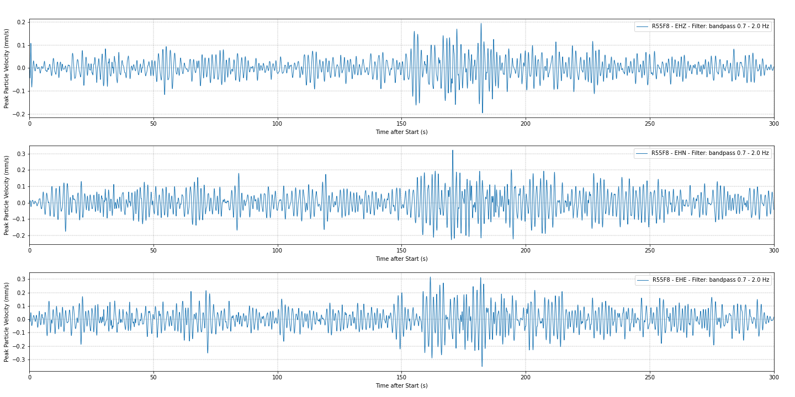

# peak-particle-velocity
Raspberry Shake Peak Particle Velocity (PPV) calculation script - Coded by G. Petricca

This script will read data from a 3D unit on the Raspberry Shake AM network (or in stand-alone mode) and convert the output displacement (in mm) into Ground Vibration measurement (PPV - in mm/s). 

The source for the conversion formula is [here](https://www.castlegroup.co.uk/guidance/ground-vibration/ground-vibration/).



Required software and packages:
- Python 3
- Jupyter
- Obspy
- Matplotlib
- Numpy

For the offline version two more packages are needed:
- datetime
- paramiko

Installation via Anaconda (online version):
```bash
# install the environment with the correct software:
conda create -n ppvmotion python=3 jupyter matplotlib obspy numpy
# activate the environment
conda activate ppvmotion
# start Jupyter Notebook
jupyter-notebook
```

Installation via Anaconda (offline version):
```bash
# install the environment with the correct software:
conda create -n ppvmotion python=3 jupyter matplotlib obspy numpy datetime paramiko
# activate the environment
conda activate ppvmotion
# start Jupyter Notebook
jupyter-notebook
```

Once this is done, it is possible to open one of the two `.ipynb` files in the repository: 
- [PPVmotion-online.ipynb](online/PPVmotion-online.ipynb) for when the station is connected to the network
- [PPVmotion-offline.ipynb](offline/PPVmotion-offline.ipynb) for when the station is in stand-alone mode

Some data are provided in the offline folder for testing purposes. Please keep the folder structure as it is.

The file is commented throughout the various steps, however, this is a brief guide to use it: 

1. Insert a valid Raspberry Shake 3D (RS3D) unit code
2. Insert a valid start and end time references for the script to work. The format is "YYYY-MM-DDThh:mm:ss.ddd"
3. If needed, modify the values for the filtering process (the default is a bandpass filter between 0.7 Hz and 2.0 Hz)
4. The filter can also be removed by commenting out (with ```#```) line 48 of the online script or line 94 of the offline script ```st.filter("bandpass", freqmin=f1, freqmax=f2, corners=cor)```

Done! Executing the script will create and save a plot which whill show the Peak Particle Velocity (in mm/s) for each channel (EHZ, EHN, EHE) of the selected RS3D unit.
